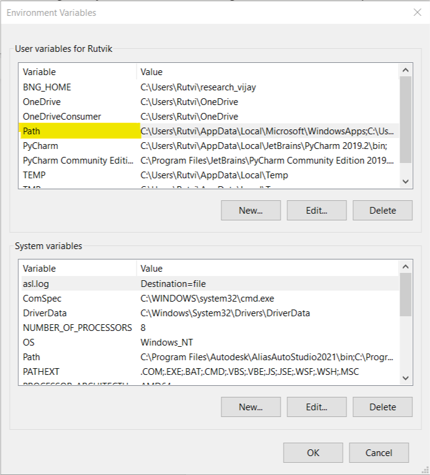
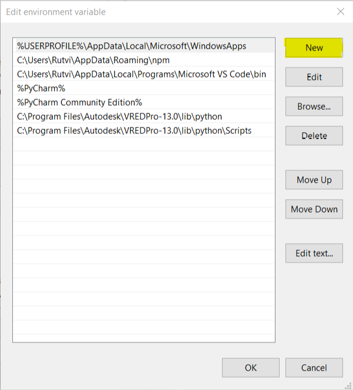

# Installation guide

Requires VRED 2021
To run speech recognition in your VRED you first need to download and install the speech recognition library. 
PyAudio is required to use and enable the microphone input.

## Setting up Environment Variables 
Click on the start button and start typing the following “Environment Variables”. As you start typing this word you will get the suggestion “Edit the system environment variables” and click on it. 
You will get the following window.
Click on Environment Variables.

A new window will pop up. Now double click on the “Path” under the User Variables. 

This window will pop up (Note: The values inside this window might be different for your system). 

Click on New and paste the following address:

`C:\Program Files\Autodesk\VREDPro-13.0\lib\python`

and click enter. Now add another address 

`C:\Program Files\Autodesk\VREDPro-13.0\lib\python\Scripts` 

and click enter again. Now follow the same procedure for “Path” under the System Variables. 
Click Ok and exit the environment variables. Now restart your computer. 

## Installing pip

To install pip in your system first write following command in the location where you want to download get -pip.py file and open terminal:

`curl https://bootstrap.pypa.io/get-pip.py -o get-pip.py`

Then run the following command in the folder where you have downloaded get-pip.py:

`python get-pip.py`

If you encounter any error then follow the mentioned steps:
1. Download [pip37.zip](https://github.com/simonnagel/VRED-voiceRecognition/raw/master/sources/pip37.zip)
2. Extract to `C:\Program Files\Autodesk\VREDPro-13.0\lib\python\Lib\site-packages`
Pip is now installed!
To check your pip version and to confirm pip has been installed correctly run the command:

`python -m pip --version`

## Speech Recognition

Open terminal and write the following command:

`python -m pip install SpeechRecognition`

Once the installation is finished you can verify the installation by writing the following code into your VRED terminal:

`>>> import speech_recognition as sr`
`>>> sr.__version__`
`>>> ‘3.8.1’`

## PyAudio

Open terminal and write the following command:

`python -m pip install SpeechRecognition`

If you encounter an error message: 
`“error: Microsoft Visual C++ 14.0 is required”`

Download [PyAudio-0.2.11-cp37-cp37m-win_amd64.whl](https://github.com/simonnagel/VRED-voiceRecognition/raw/master/sources/PyAudio-0.2.11-cp37-cp37m-win_amd64.whl) 
original source [https://www.lfd.uci.edu/~gohlke/pythonlibs/#pyaudio](https://www.lfd.uci.edu/~gohlke/pythonlibs/#pyaudio)

Now, open terminal in the folder where the file is downloaded.
Press shift + right click in the folder (click anywhere in the empty space) and click on “Open Powershell Window Here”
Now in the terminal write the following command:

`python -m pip install PyAudio 0.2.11 cp37 cp37m win_amd64.whl`

Sources: 
How to install pip
Speech Recognition 
PyAudio 
How to install packages in python 
